# Lab Introduction

<!-- TOC -->

- [Lab Introduction](#lab-introduction)
    - [Introduction to CloudForms](#introduction-to-cloudforms)
        - [Access the lab environment](#access-the-lab-environment)
    - [Verify Lab](#verify-lab)
        - [Red Hat Virtualization Provider status](#red-hat-virtualization-provider-status)
    - [CloudForms with Ansible batteries included](#cloudforms-with-ansible-batteries-included)
        - [Introduction to Ansible](#introduction-to-ansible)
        - [Value provided by a Service Catalog](#value-provided-by-a-service-catalog)
        - [Service Basics](#service-basics)
        - [Power on target VM](#power-on-target-vm)
        - [Make sure embedded Ansible role is enabled and running](#make-sure-embedded-ansible-role-is-enabled-and-running)
        - [Add a Git repository of Ansible Playbooks](#add-a-git-repository-of-ansible-playbooks)
        - [Store Virtual Machine Credentials](#store-virtual-machine-credentials)
        - [Create an Ansible Service Catalog](#create-an-ansible-service-catalog)
        - [Create a Service Catalog Item](#create-a-service-catalog-item)
        - [Test the Service Catalog Item](#test-the-service-catalog-item)
    - [Add a button to a Virtual Machine](#add-a-button-to-a-virtual-machine)
        - [Add a Button Group](#add-a-button-group)
        - [Add a new Button to the Button Group](#add-a-new-button-to-the-button-group)
        - [Test the Ansible Button Customization](#test-the-ansible-button-customization)
    - [Button visibility and enablement](#button-visibility-and-enablement)
        - [Button enablement](#button-enablement)
        - [Button visibility](#button-visibility)
        - [Role based access control](#role-based-access-control)
        - [Configure Enablement](#configure-enablement)
        - [Configure Visibility](#configure-visibility)
    - [Improve the Service Dialog](#improve-the-service-dialog)
        - [Edit the Service Dialog](#edit-the-service-dialog)
        - [Create improved Service Catalog Item](#create-improved-service-catalog-item)
        - [Update the Button definition](#update-the-button-definition)
        - [Test the improved Button](#test-the-improved-button)
    - [Run an Ansible Playbook during VM provisioning](#run-an-ansible-playbook-during-vm-provisioning)
        - [Create a new Automate Domain](#create-a-new-automate-domain)
        - [Copy VM Provisioning State Machine](#copy-vm-provisioning-state-machine)
        - [Copy CheckProvisioned Method](#copy-checkprovisioned-method)
        - [Create the Ansible Playbook Method](#create-the-ansible-playbook-method)
        - [Modify the Schema](#modify-the-schema)
        - [Change Schema Sequence](#change-schema-sequence)
        - [Test the updated Virtual Machine Provisioning State Machine](#test-the-updated-virtual-machine-provisioning-state-machine)
    - [Advanced labs](#advanced-labs)
        - [Use the Self Service user Interface](#use-the-self-service-user-interface)
        - [Build a button to execute remote commands](#build-a-button-to-execute-remote-commands)
            - [The use case](#the-use-case)
            - [Service Dialog](#service-dialog)
            - [Service Catalog Item](#service-catalog-item)
            - [Button](#button)
            - [Improve it further](#improve-it-further)
            - [Need Help?](#need-help)
    - [Even more?](#even-more)

<!-- /TOC -->

## Introduction to CloudForms

[Red Hat CloudForms](http://www.redhat.com/cloudforms) is an infrastructure management platform that offers a consistent way to track costs, control resource allocation, and ensure compliance across all your networked environments. Manage Virtual Machines, containers, and your clouds in the same way with a single tool.

In this lab we will focus on he Ansible features provided by CloudForms. We will setup the embedded Ansible role, create Service Catalog Items for Ansible Playbooks, and demonstrate how the CloudForms UI can be exteded with custom menus and buttons.

For more details about CloudForms, you can have a look at the [General introduction](../../common/index.md).

### Access the lab environment

TODO: Update for RHTE FY19 process

- First time login, forgot login or password? Go to [https://www.opentlc.com/account](https://www.opentlc.com/account)

- Your username should NOT have an *@* in it.

- Partners MUST request access to RHPDS by sending an email to open-program@redhat.com.

- Passwords to the services is referred as `<to_be_provided>`. Please contact GPTE you didn't get them.

Log into RHDPS and order the Lab from the Service Catalog as follows:

1. Log in to the [Red Hat Product Demo System](https://rhpds.redhat.com/) with your provided credentials. 

    

1. Go to ***Services*** -> ***Catalogs***

    

1. Under ***All Services*** -> ***Red Hat Summit 2018***, select ***CloudForms with Ansible Better together!***

    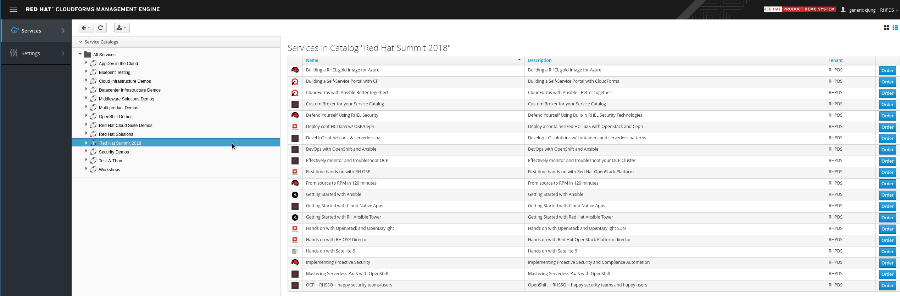

1. On the right pane, click ***Order***

    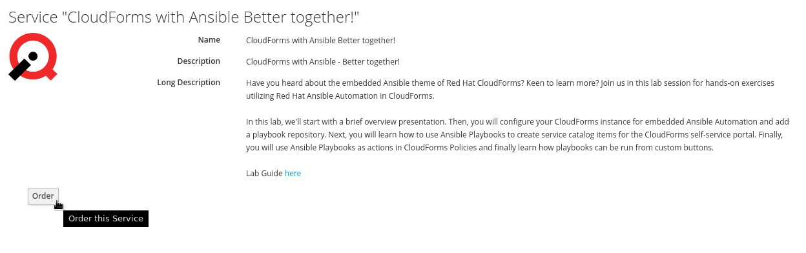

1. Please, read carefully all of the information on the resulting page, check the box to confirm you understood the runtime warning message, and then click *Submit*.

:warning: ***WARNING*** It takes about 20 ~ 25 minutes for the demo to load completely and become accessible. Wait for the full demo to load, even if some of its systems are marked "Up.". Watch for an email with information about how to access your demo environment. Make note of the email's contents: a list of hostnames, IP addresses, and your GUID. Whenever you see <GUID> in the demo instructions, replace it with the GUID provided in the email. You can get real-time updates and status of your demo environment at [https://www.opentlc.com/rhpds-status](https://www.opentlc.com/rhpds-status).

:heavy_check_mark: ***NOTE*** Be mindful of the runtime of your demo environment! It may take several hours to complete the demo, so you may need to extend the runtime. This is especially important in later steps when you are building virtual machines. For information on how to extend runtime and lifetime, see https://www.opentlc.com/lifecycle.

## Verify Lab

Let's start by verifying the status of all providers. Use the URL as desplained before and the provided login credentials.

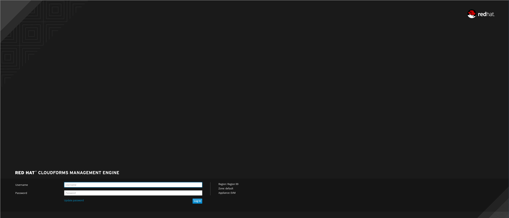

In CloudForms we can add so called "Providers". Providers are categorized into Cloud, Infrastructure, Physical and Container Providers. CloudForms 4.6 supports the following list of providers:

Cloud Providers:

- Amazon EC2
- Microsoft Azure
- Google Compute Platform

Infrastructure as a Service Providers:

- Red Hat Virtualization
- Red Hat OpenStack Platform
- VMware vSphere
- Microsoft System Center Virtual Machine Manager

Physical Providers:

- Lenovo XClarity

Container Providers:

- OpenShift Container Platform

Let's first verify the providers you have available and check their health status.

### Red Hat Virtualization Provider status

Let's then check the RHV Provider:

1. Navigate to ***Compute*** -> ***Infrastructure*** -> ***Providers***

    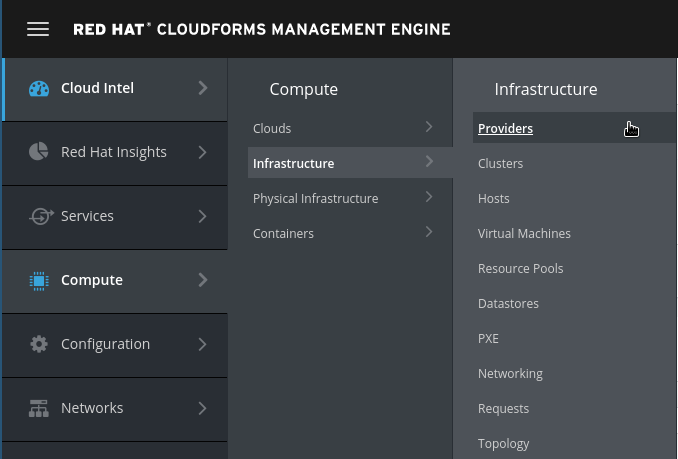

1. You should see a tile icon labeled "RHV". Click on it.

    

1. Click on ***Authentication*** -> ***Re-check Authentication Status***

    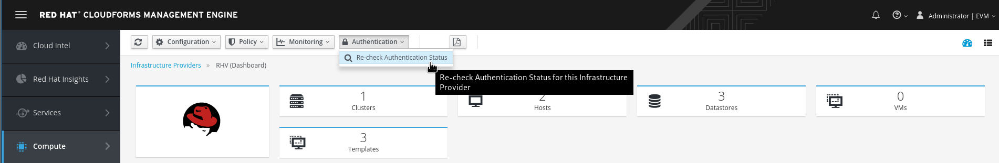

    This will validate the credentials are correct, and it will also restart the provider specific background processes.

1. Switch to the ***Summary view*** by clicking the little icon on the top right

    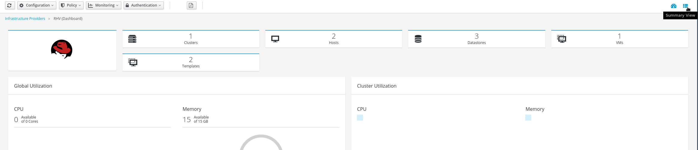

1. Click the little arrow to reload the page.

    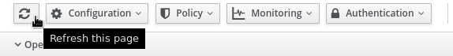

Wait a few moments before you reload the page, the provider tile should show a green check mark and the last refresh fields should report "less than a minute ago" or similar.

:heavy_check_mark: ***NOTE*** Don't worry if the last refresh does not change. As long as the provider icon is showing a green check box, you're good and can carry on with the lab.

:warning: ***WARNING*** If the provider icon does not show a green check mark, consult an instructor before you continue with the lab!

## CloudForms with Ansible batteries included

This first excersie of the lab will guide you through the process of creating a Service Catalog Item based on an Ansible Playbook.

### Introduction to Ansible

Today, every business is a digital business. Technology is your innovation engine, and delivering your applications faster helps you win. Historically, that required a lot of manual effort and complicated coordination. But today, there is Ansible - the simple, yet powerful IT automation engine that thousands of companies are using to drive complexity out of their environments and accelerate DevOps initiatives.

Red Hat CloudForms can integrate with IaaS, PaaS, public and private cloud, and configuration management providers. Since version 4.2 of CloudForms, it can also integrate with Ansible Tower by Red Hat. The latest version which is 4.6, which has an improved "embedded Ansible" role which allows it to run Playbooks, manage credentials and retrieve Playbooks from a source control management like git.

This integration give customers the capability to build Service Catalogs from Ansible Playbooks to allow end users to easily browse, order and manage resources from Ansible. Ansible Playbooks can be used in Control Policies which can not only detect problems, but also automatically fix them. The User Interface of CloudForms can be extended seamless with additional menus and buttons, which utilize Ansible Playbooks to perform user initiated tasks.

### Value provided by a Service Catalog

One of the features a Cloud Management Platform provides, is a Self Service User Interface. From the Service Catalog users can order, manage and retire Services. Services are categorized in Catalogs, where they can be organized and easily consumed.

By providing a Service Catalog, users can deploy the Services they need quickly and easily. This helps to improve agility, reduce provisioning time and free up resources in internal IT.

### Service Basics

But first some basics. Four items are required to make a Service available to users from the CloudForms Self Service Catalog:

1. Provisioning Dialog

   The Provisioning Dialog specifies the list of customizable parameters. For example, when ordering a Virtual Machine, users can specify the number of virtual CPUs, how much memory the VM should have and other parameters. The list of possible parameters is defined in the Provisioning Dialog

1. A Service Dialog

    When the user orders a Service Catalog Item from the Service Catalog, you might want to allow them to override certain default values. For example, you might allow users to choose from a range of values of how much memory the new Virtual Machine can have. You might want them to only choose from a list of predefined values like 2, 4, or 8 GB of RAM - but not more or less. This is specified in the Service Dialog.

1. A Service Catalog Item

    The Service Catalog Item is what users will see in the Service Catalog and are able to order. It usually consists of a Service Dialog allowing users to change specific parameters, it can have a nice icon and an (optional) HTML description. Service Catalog Items are organized in Service Catalogs for easier navigation.

1. A Service Catalog

    The Service Catalog allows administrator to organize the Catalog Items. You might want to have a Catalog for different Virtual Machine types, or one offering certain applications like Wordpress, MariaDB etc. Or you might want to categorize by Operating System. This is done by creating Service Catalogs and adding Items to them.

We can also use Role Based Access Control to make certain Service Catalog Items available only to specific groups of users.

### Power on target VM

The following lab will use UI customizations to illustrate how easy it is to add additional functionality to CloudForms. The example will use an Ansible Playbook which will be executed on a Virtual Machine. Ansible uses SSH to access the remote machine and therefore the VM has to be powered on. The following steps will power on a Virtual Machine which we later use as the target for the Ansible Playbook.

1. Navigate to ***Compute*** -> ***Infrastructure*** -> ***Virtual Machines***

    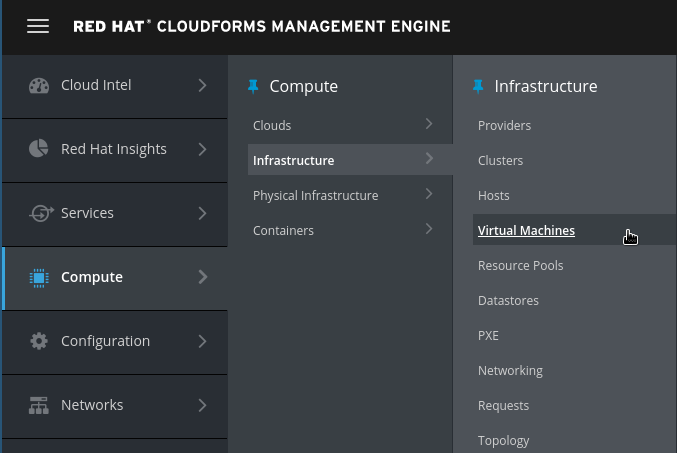

1. Tiles represent the Virtual Machines. Note that the VM "cfme001" is powered off.

    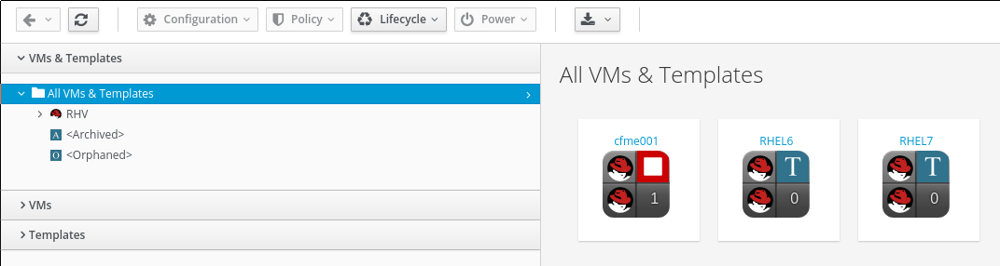

1. Click on the tile icon "cfme001" to see the VM details.

1. Click ***Power*** -> ***Power On*** to power on the Virtual Machine

    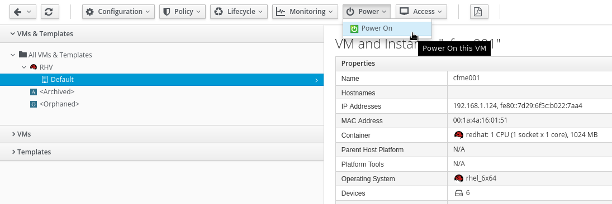

1. CloudForms will perform this action in the background and it will take a few minutes to complete. Click on the reload icon in the menu bar to reload the screen.

    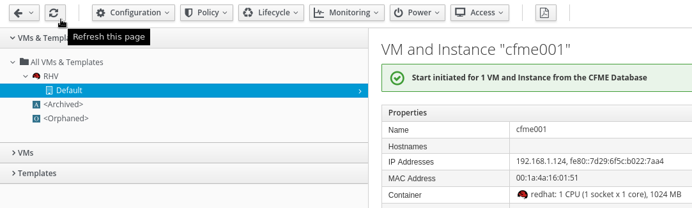

1. Verify the "Power State" of the Virtual Machine has changed to "on" before you proceed with the next steps of the lab.

    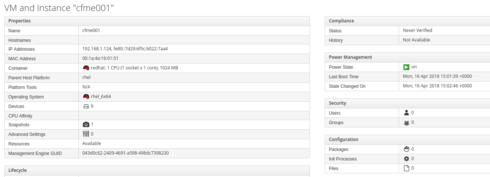

    :heavy_check_mark: ***NOTE*** The VM should also report an IP address in the 192.168.1.0/24 network.

Now our test VM is up and running and we can proceed with the next steps.

### Make sure embedded Ansible role is enabled and running

Before we continue, we want to make sure the embedded Ansible role is enabled and running.

1. Click on your user name on the top right and click on ***Configuration***

    

1. Make sure the "Embedded Ansible" and the "Git Repositories Owner" Roles are enabled

    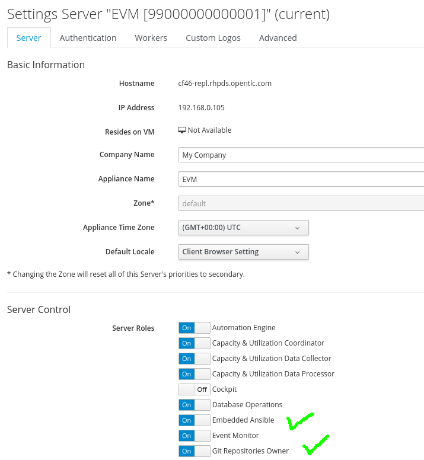

1. Click on ***Diagnostics*** in the accordion on the left and click on the ***Workers*** tab

1. Make sure you can see a line indicating the "Embedded Ansible Worker" is in state "started"

    :heavy_check_mark: ***NOTE*** The git role is not represented by a specific worker process.

    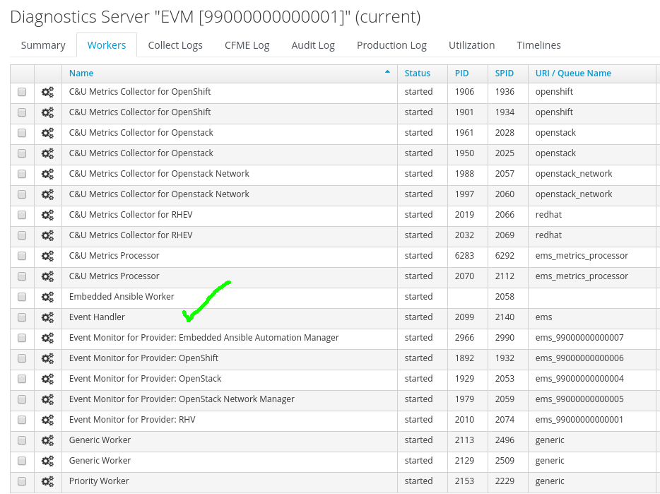

:warning: ***WARNING*** We've noticed that sometimes the role does not start automatically. You can trigger a restart by clicking on ***Diagnostics*** -> ***Server*** and then ***Configuration*** -> ***Restart Server***. This will trigger a restart of all services and can take a few minutes to complete. Only do this, if your Embedded Ansible role was not in state "started".

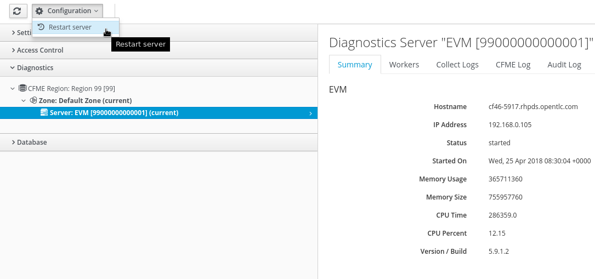

### Add a Git repository of Ansible Playbooks

To be able to run Ansible Playbooks, they have to become available in CloudForms. Custom git repositories can be used as well as GitHub, GitLab or others. Other Source Control Management Systems like Subversion or Mercurial are planned for later versions.

1. Navigate to ***Automation*** -> ***Ansible*** -> ***Repositories***.

    

1. Click on ***Configuration*** -> ***Add New Repository***

    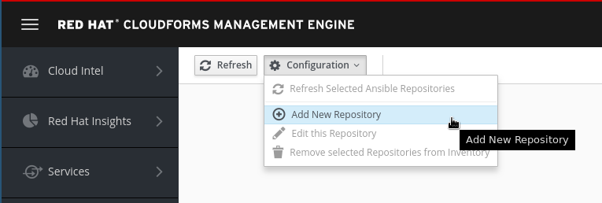

    :warning: ***WARNING*** If the menu item "Add New Repository" is disabled, the Git Repository Role is not active.

1. Fill in the form.

    An internal name for the git repository:

    ***Name:*** Github

    A description for the git repository:

    ***Description:*** Example Playbooks

    How to access the git repository:

    ***URL:***

        https://github.com/cbolz/rhte-fy19.git

    Update on Launch causes CloudForms to check for new Playbooks or updated Playbooks before a Playbook is launched.

    ***SCM Update Options:*** check "Update on Launch"

    

1. Click on ***Add*** to save the settings

    :heavy_check_mark: ***NOTE*** It takes a few seconds for the action to complete. A pop up notification will inform you after the task was completed.

1. You can click on your username in the top right corner and then on ***Tasks*** to see all currently running tasks. Switch to ***All Tasks*** to see the progress of your Repository import.

1. Verify the task completed successfully

    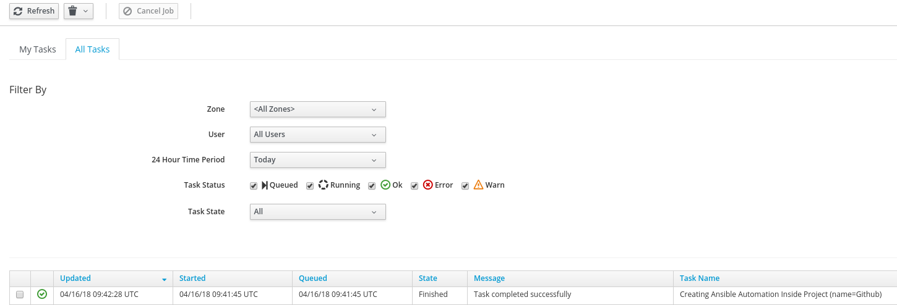

1. Navigate back to ***Automation*** -> ***Ansible*** -> ***Repositories***.

    

1. Click on the ***Reload*** icon to refresh the screen. After the initial import completed, you will see the list of available repositories.

    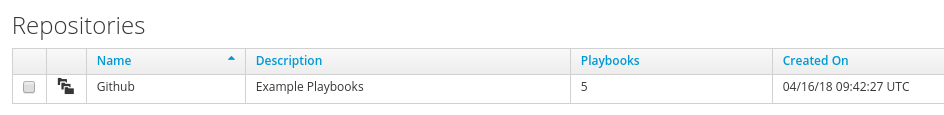

1. Click on the repository to see the details.

    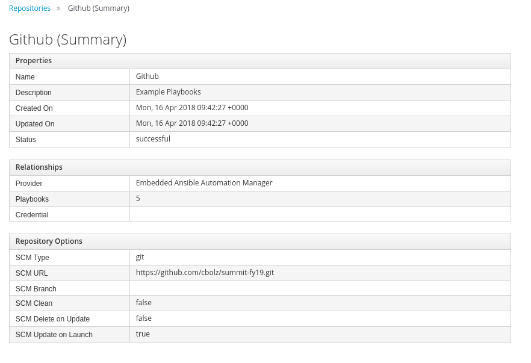

1. Click on ***Playbooks*** to see the list of automatically imported playbooks.

    

This confirms that all playbooks have been imported successfully.

### Store Virtual Machine Credentials

Ansible is using SSH by default to perform actions on the target machine. To be able to login, it has to know the login credentials.

1. Navigate to ***Automation*** -> ***Ansible*** -> ***Credentials***

    

1. Click on ***Configuration*** -> ***Add a new Credential***

    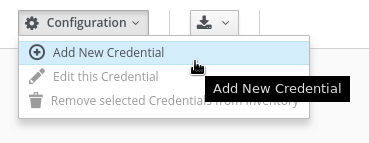

1. Use the following settings:

    A user descriptive name for the Credentials you want to store:

    ***Name:*** Virtual Machine credentials

    CloudForms supports several credential types to connect to other systems. For this lab we chose "Machine":

    ***Credential type:*** Machine

    The username used to login to the target system:

    ***Username:*** root

    The password used to login to the target system:

    ***Password:*** `<to_be_provided>`

    Passwrds are stored encrypted in the CloudForms database.

    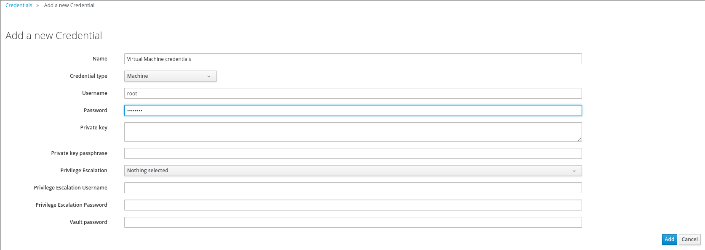

1. Click ***Add** to save the credentials

    Once more this is an action which is preformed in the background and it can take a few seconds until you can see the new credentials in the Web UI.

### Create an Ansible Service Catalog

To offer a Service Catalog Item to users, they have to be organized in Service Catalogs. Create one by following these steps:

1. The next step is to create a Service Catalog. First we have to navigate to ***Services*** -> ***Catalogs***.

    

1. On this screen click on ***Catalogs*** on the left

    

1. Click on ***Configuration*** and ***Add a New Catalog***

1. Fill out name and description:

    A user friendly name of the Service Catalog. End users will see the different Service Catalogs by name:

    ***Name:*** Ansible

    Additional description about the Service Catalog. End users will see the description and it will help them to find the Service Catalog Items they are looking for:

    ***Description:*** Order Ansible Playbooks from a Service Catalog

    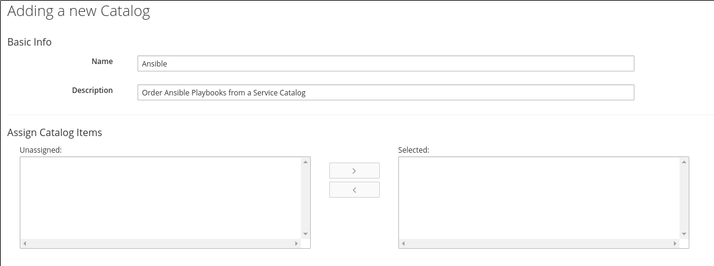

1. Click on ***Add*** to save the new Catalog

### Create a Service Catalog Item

In the following step we create a Service Catalog Item which will execute an Ansible Playbook.

1. Navigate to ***Services*** -> ***Catalogs***

    

    :heavy_check_mark: ***NOTE*** If you followed the instructions by the letter, you're already in this part of the UI.

1. Navigate to ***Catalog Items*** in the accordion on the left

    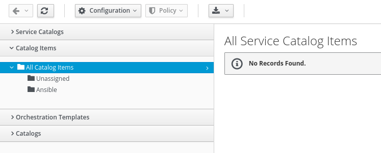

1. Click on ***Configuration*** -> ***Add a New Catalog Item***

    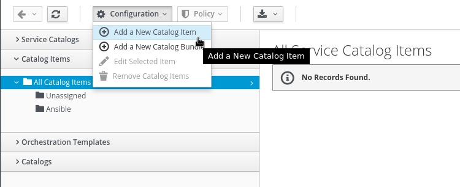

1. Select ***Ansible Playbook*** as Catalog Item Type

    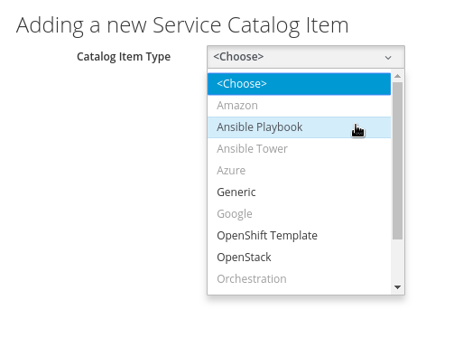

1. Use the following parameters when defining the Service Catalog Item:

    The user friendly name of the Service Catalog Item. It will be presented to the end user:

    ***Name:*** Install Package

    Additional description about the Service Catalog Item to make it easier for the end user to find what they are looking for:

    ***Description:*** Install Package via Ansible Playbook

    You can hide Service Catalog Items from users by setting this to "No". For this lab we want to allow users to order the Service Catalog Item, so we set this to "Yes"

    ***Display in Catalog:*** Yes

    In which Service Catalog do you want the Service Catalog Item to show up?

    ***Catalog:*** Ansible

    You might have many git repositories, to better identify the correct Ansible Playbook, you first select the Repository. We only have one Repository so far, so this is simple:

    ***Repository:*** Github

    The actual Playbook which will be exected when the Service Catalog Item is ordered.

    ***Playbook:*** playbooks/InstallPackage.yml

    The credentials used to login to the target machine to run the Ansible Playbook:

    ***Machine Credentials:*** Virtual Machine credentials

    Ansible Playbooks can use variables which gives us more flexiblity. In this example the package name is not hard coded, but can be set and changed from a variable:

    ***Variables & Default Values***: add one new entry with:

    Since a Playbook can have multiple variables, you can add multiple lines. 

    ***Variable:*** package_name

    ***Default Value:*** httpd

    Click the little plus ("+") icon to save the row. We only use one variable in this playbook, but your Playbooks might use more.

    ***Dialog:*** Create New

    Use "InstallPackage" as the name of the Dialog. CloudForms will automatically create the Service Dialog for us, to save some time. The automatically created Service Dialog is still fully customizable, which we will do in a later part of the lab.

    

1. Click ***Add*** to save all changes

### Test the Service Catalog Item

We want to make sure the resulting Service Catalog Item actually works.

1. Navigate to ***Services*** -> ***Catalogs***

    

1. Click on ***Service Catalogs*** in the accordion on the left, if not already selected

    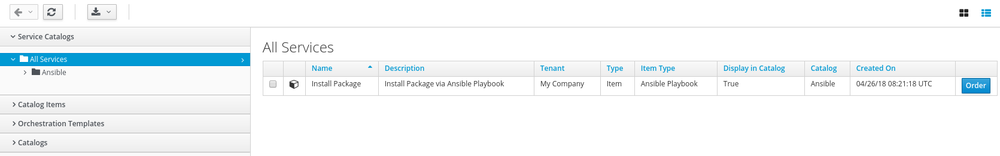

1. Select the "Install Package" Service Catalog Item

    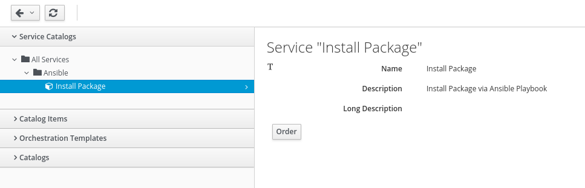

1. Click ***Order***

1. Select the following options:

    These are the credantials stored in CloudForms earlier, to log into the target machine:

    ***Machine Credentials:*** Virtual Machine Credentials

    On which machine the Playbook should be executed:

    ***Hosts:*** localhost (should already be the default)

    The varaible specified when creating the Service Catalog Item, which can be overriden by the end user during order:

    ***package_name:*** httpd (should already be the default)

    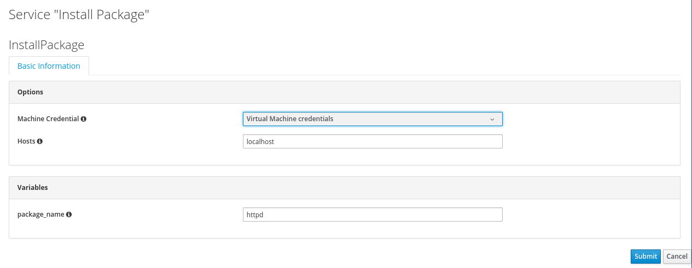

1. Click on ***Submit***

1. After submitting your order, you will be redirected to the Requests Queue. You should also see pop up notifications on the top right informing you about the progress of your order.

1. :+1: ***OPTIONAL*** Click on ***Refresh*** to monitor the progress of your order

1. Navigate to ***Services*** -> ***My Services***

    

1. Every time a user places an order a object under "My Services" is created. You should see one tile labeled "Install Package"

    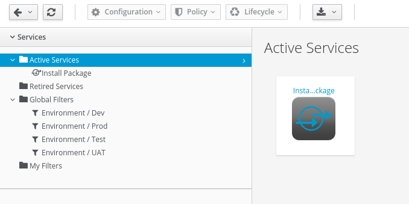

1. Click on the tile icon to get more details

    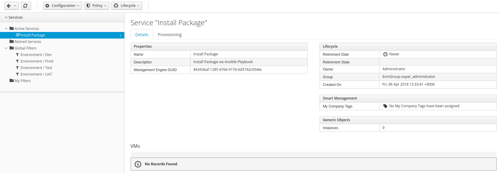

1. Click on the tab ***Provisioning*** to see details of the Ansible Playbook run

    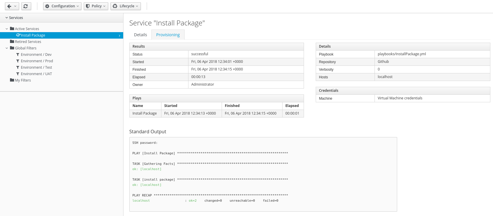

    :heavy_check_mark: ***NOTE*** In this example the Playbook completed successfully. In your case it might be still running and not be complete. Click the little reload icon on the page to reload the information while the Playbook is executed in the background.

This concludes this part of the lab.

## Add a button to a Virtual Machine

CloudForms can easily be extended by adding additional menus and buttons. This allows seamless integration of customizations and making them available to end users.

### Add a Button Group

To add new button to the UI, we first need to create a Button Group. A Button Group is basically a new menu entry in the UI. Buttons and Button Groups can be assigned to several objects in CloudForms.

1. Navigate to ***Automation*** -> ***Automate*** -> ***Customization***

    

1. Click on ***Buttons*** in the accordion on the left

    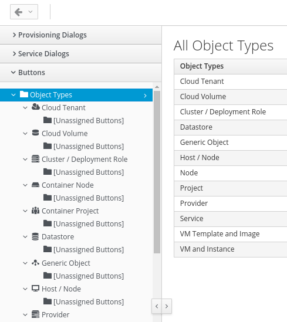

1. Click on ***VM and Instance***

    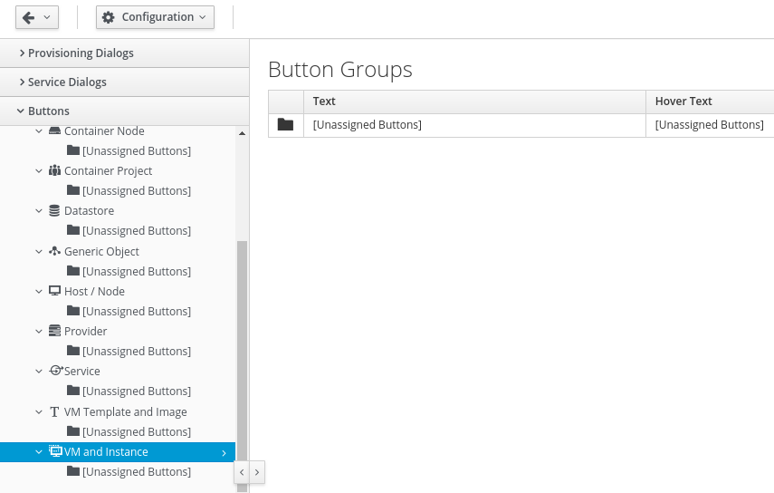

1. Click on ***Configuration*** -> ***Add a new Button Group***

1. Enter the following data into the form:

    The name of the Button Group, or menu, as shown in the UI:

    ***Text:*** Tools

    A description text which will be shown when hovering the mouse over the Button Group:

    ***Hover Text:*** Additional tasks

    An icon for the Button Group:

    ***Icon:*** search for the wrench symbol in ***Font Awesome***

    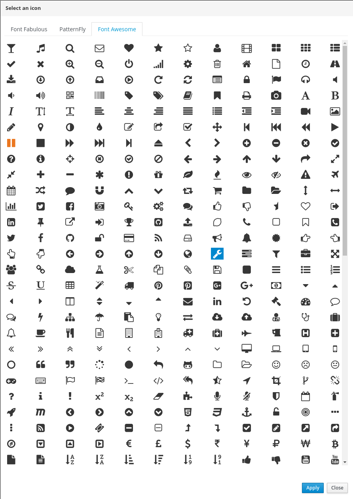

    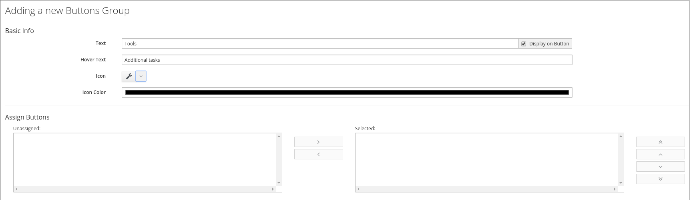

1. Click ***Add*** to create the button group

In the next section we will add a button to the group.

### Add a new Button to the Button Group

The previous step created a Button Group, or menu. Now we want add Buttons to the Group:

1. Navigate to ***Automation*** -> ***Automate*** -> ***Customization***

    

    :heavy_check_mark: ***NOTE*** You should already be in this menu if you followed the previous steps

1. Click on the "Tools" Button Group you created in the previous lab

    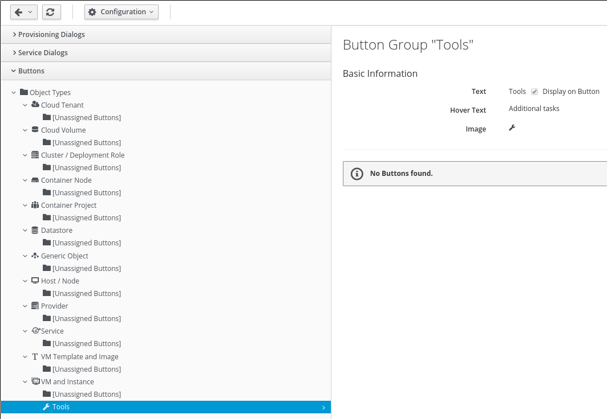

1. Click on ***Configuration*** -> ***Add a new Button***

    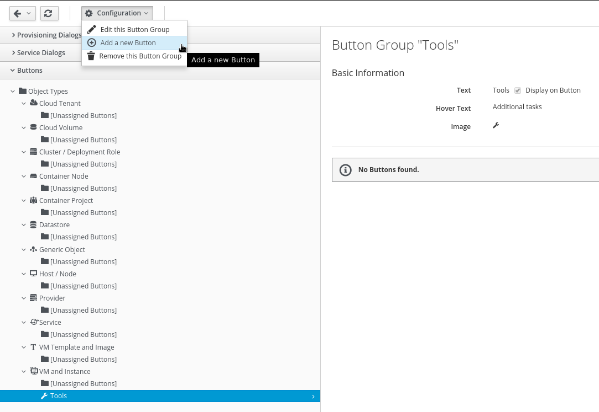

1. Make the following adjustments:

    There are different Button types to extend the CloudForms UI:

    ***Button Type:*** Ansible Playbook

    Which action should be performed, when a user submits the request. In this example we call the previously created Service Catalog Item, which runs an Ansible Playbook.

    ***Playbook Catalog Item:*** Install Package - this is the Service Catalog Item you created in the previous part of the lab

    On which target system should the Ansible Playbook run? For this lab, we want it to be executed on the selected machine:

    ***Inventory:*** Target Machine

    The name of the Button which will be shown in the UI and should be short and descriptive:

    ***Text:*** Install Package

    A more descriptive text which will be shown if the user hovers the mouse over the Button.

    ***Hover Text:*** Install additional package

    An icon to make the Button easy to find:

    ***Icon:*** Select the Software Package Icon at the "Font Fabulous" tab and click ***Apply***

    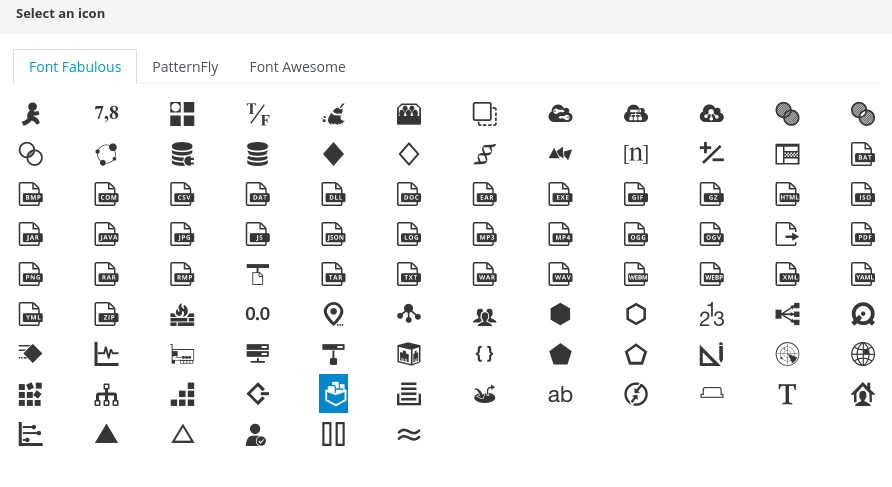

    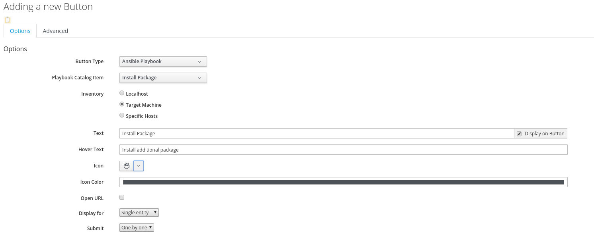

1. Click ***Add*** to save the Button

This adds a new Button to the Button Group "Tools".

### Test the Ansible Button Customization

We want to test the resulting customization and see how it works from a user point of view.

1. Navigate to ***Compute*** -> ***Infrastructure*** -> ***Virtual Machines***

    

1. Click on the "cfme001" tile if not already selected

    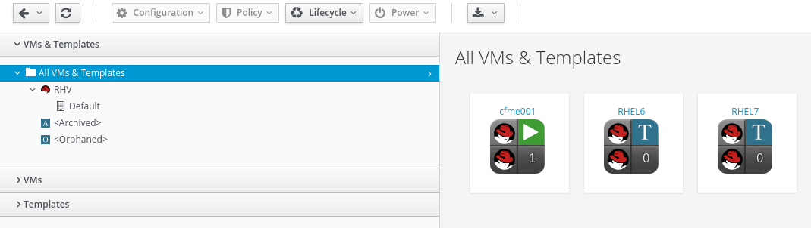

1. On the details page of "cfme001" note the new menu "Tools". Click to see the new button "Install Package"

    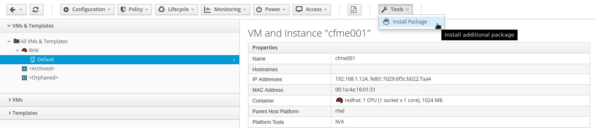

1. Click on ***Tools*** -> ***Install Package***

    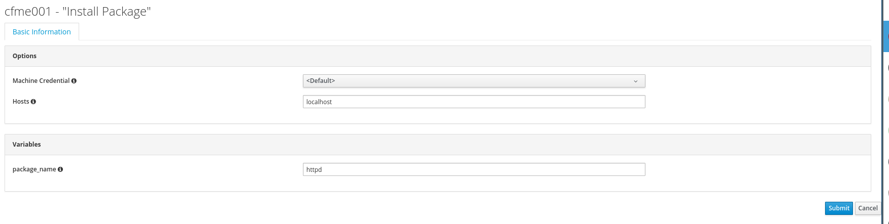

1. We can accept the values and click on ***Submit***

1. Navigate to ***Services*** -> ***My Services***

    

    :heavy_check_mark: ***NOTE*** You might have to click on ***Active Services*** to see the updated overview of all your services.

1. As a result of your action, a new "My Services" object was created. If you don't see it yet, wait a minute and click on the reload button.

1. Click on the "Install Playbook" item to see the details

    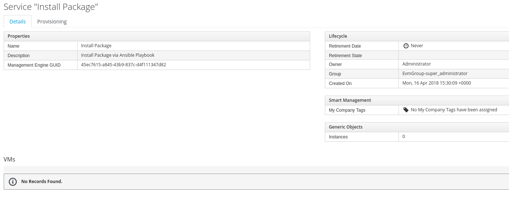

1. Click on the ***Provisioning*** tab to see output from your Ansible Playbook

    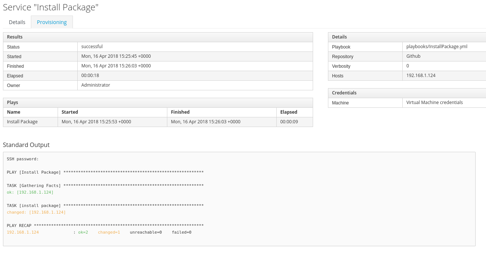

:heavy_check_mark: ***NOTE*** Ansible is idempotent - this means you can run the same Playbook many times and Ansible detects if the desired state was already reached. In this lab, no changes are necessary, because the package httpd is already installed.

This concludes this part of the Ansible lab.

## Button visibility and enablement

Starting with CloudForms 4.6, we can make custom buttons visible if certain requirements are met. We can also make the button active or inactive as needed. Both features significantly improve the user experience by simplifying the interface and making it more dynamic.

### Button enablement

The Enablement expression is validated to enable or disable the button based on the specified check. This allows you to enable the button only if some specific requirements are met. In the example below, we want to run an Ansible Playbook inside the VM. The expression validates the VM Power State and the button will be disabled if the VM is not powered on. An additional text will inform the user why the button is disabled and how to solve the issue.

### Button visibility

The Visibility allows you to define an expression which is validated to decide if the button should be shown at all. For example, if the guest Operating System is not Linux, the Ansible Playbook used will not work. If CloudForms detects a non-Linux VM, the menu will not be shown at all.

### Role based access control

Note that the visibility settings on the bottom of the dialog are the same as in previous versions. This option allows us to make the button only available for certain user roles, for example administrators, operators or normal users.

### Configure Enablement

Let's configure an regular expression which verifies the Virtual Machine is powered on.

1. Navigate to ***Automation*** -> ***Automate*** -> ***Customization***

    

    :heavy_check_mark: ***NOTE*** You should already be in this menu if you followed the previous steps

1. Click on the "Tools" Button Group you created in the previous lab

    

1. Click on ***Configuration*** -> ***Edit this Button***

    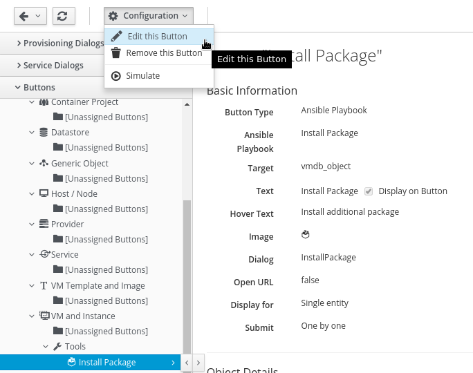

1. Click on the ***Advanced*** tab

1. Click on ***Expression***

1. Build the following Expression:

    Field: VM and Instance - Power State = on

    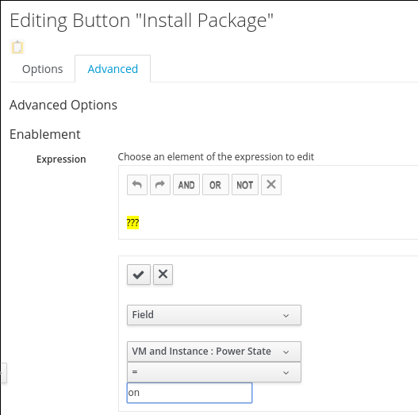

    :warning: ***WARINING*** Don't forget to click on the check mark to save the expression!

1. Add Disabled Button Text: VM must be powered on to run Ansible Playbook

    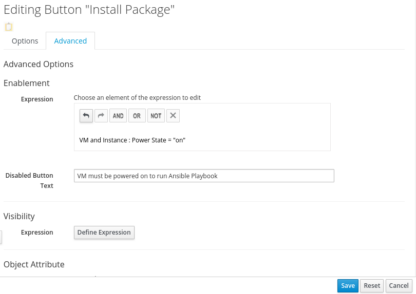

1. Click ***Save***

### Configure Visibility

The install package Playbook will only work on RHEL 7 Virtual Machines. It will fail on RHEL 6 Virtual Machines, because the lab internal YUM mirror does not have a copy of the relevant channels.

Since this is a known limitation, it is a good idea to not show the button if the guest Operating System of the selected Virtual Machine does not meet the requirements. With the new "Visibility" expression filter, this is easy to implement.

1. Navigate to ***Automation*** -> ***Automate*** -> ***Customization***

    

    :heavy_check_mark: ***NOTE*** You should already be in this menu if you followed the previous steps

1. Click on the "Tools" Button Group you created in the previous lab

    

1. Click on ***Configuration*** -> ***Edit this Button***

    

1. Click on the ***Advanced*** tab

1. in the ***Visibility*** section of the dialog, create the following expression:

    Field: VM and Instance.OS: Product Name - STARTS WITH "rhel_7"

    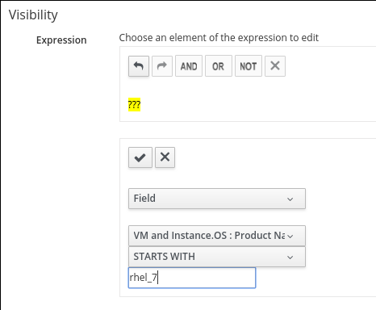

    :warning: ***WARINING*** Don't forget to click on the check mark to save the expression!

    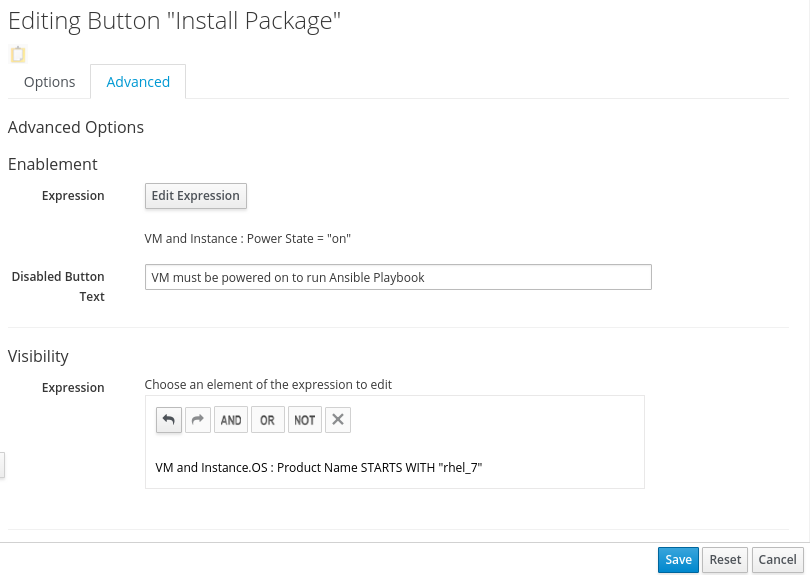

1. Click ***Save***

## Improve the Service Dialog

The automatically generated Service Dialog is not perfect. It might confuse the user with too many input fields. It asks for the "Machine Credentials", but those have already been defined in the Service Catalog Item. It also asks for the "Host", but this one is automatically adjusted to be the selected Virtual Machine. And finally the field "package_name" could benefit from a more descriptive text.

In the following steps, we want to make the Service Dialog more user friendly by simplifying it.

### Edit the Service Dialog

1. Navigate to ***Automation*** -> ***Automate*** -> ***Customization***

    

1. Click on ***Service Dialogs*** in the accordion on the left

    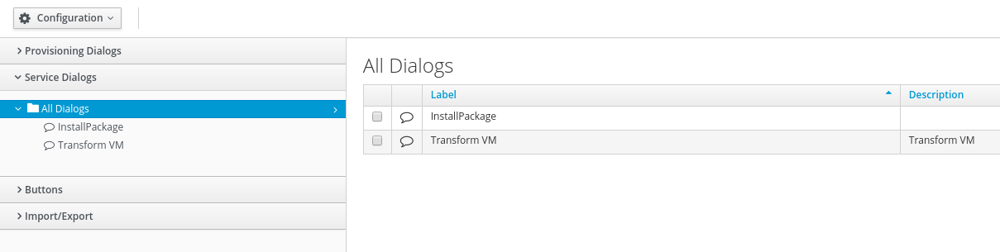

1. Click the check box next to "InstallPackage"

1. Click on ***Configuration*** -> ***Copy the selected Dialog to a new Dialog***

    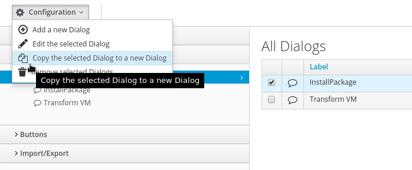

1. Let's improve the Service Dialog by applying the following changes:

    ***Dialog's name:*** Install Package from Button

1. Hide the element "Machine Credentials" by clicking on the little pen icon.

    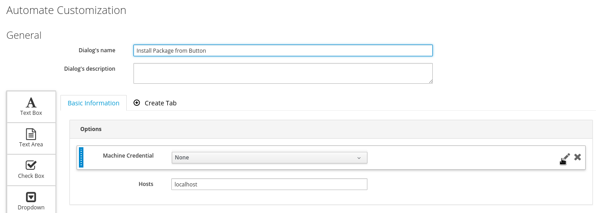

    :heavy_check_mark: ***NOTE*** The edit icon only shows if you move the mouse pointer over the "Machine Credentials" text box.

    :warning: ***WARNING*** Do not delete the element, only hide it! The element is still needed for some CloudForms internal logic and should not be removed.

1. Click on ***Overridable Options*** and switch the ***Visible*** switch to "No"

    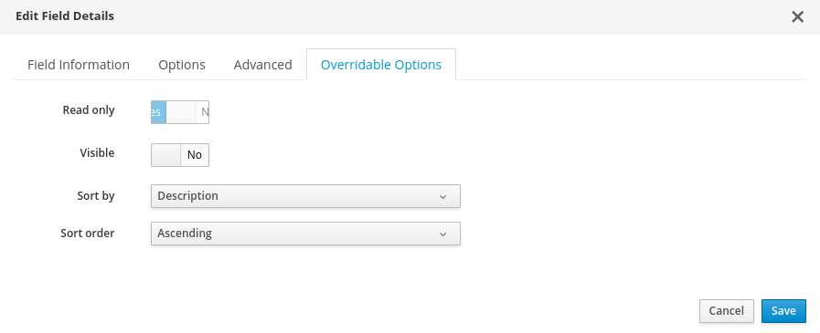

1. Click ***Save*** to close the dialog

1. Repeat this for the "Hosts" element. Click on the pen icon next to it.

    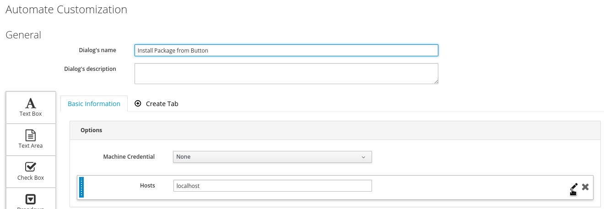

    :heavy_check_mark: ***NOTE*** The edit icon only shows if you move the mouse pointer over the "Hosts" text box.

1. Click on ***Options*** and switch ***Visible*** to "No"

    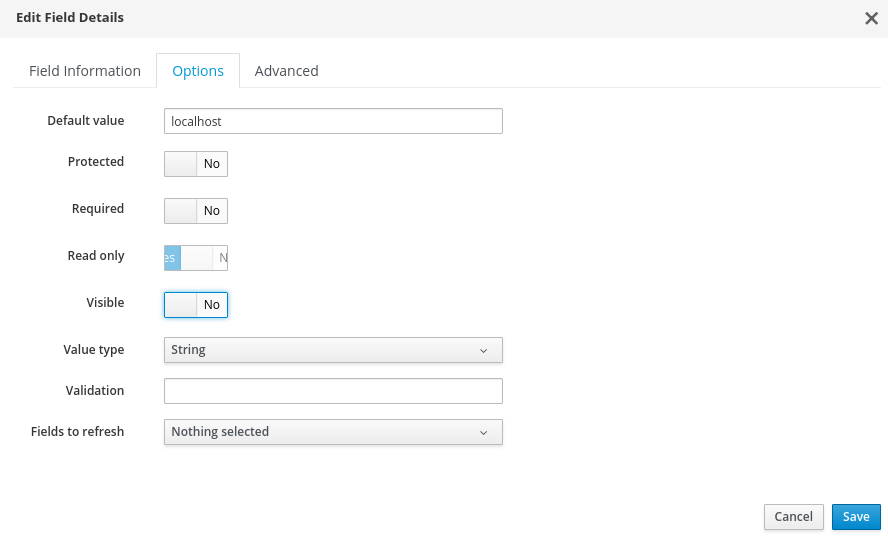

    :warning: ***WARNING*** Do not delete the element, only hide it! The element is still needed for some CloudForms internal logic and should not be removed.

1. Click on the little pen icon next to the "package_name" text box

    :heavy_check_mark: ***NOTE*** The edit icon only shows if you move the mouse pointer over the "package_name" text box.

1. Change the label to something more descriptive:

    ***Label:*** Enter Package Name

    :warning: ***WARINING*** Do not change the field "Name" - it is the name of the variable used internally by CLoudForms and the Ansible Playbook. if you change the name of this field, the Playbook will not pickup the new variable and hence ignore the user input.

1. Also let's give more information to the user by improving the "Help" text:

    ***Help:*** Enter the name of the RPM package to be installed on the system

    

1. Click ***Save*** to apply the changes

    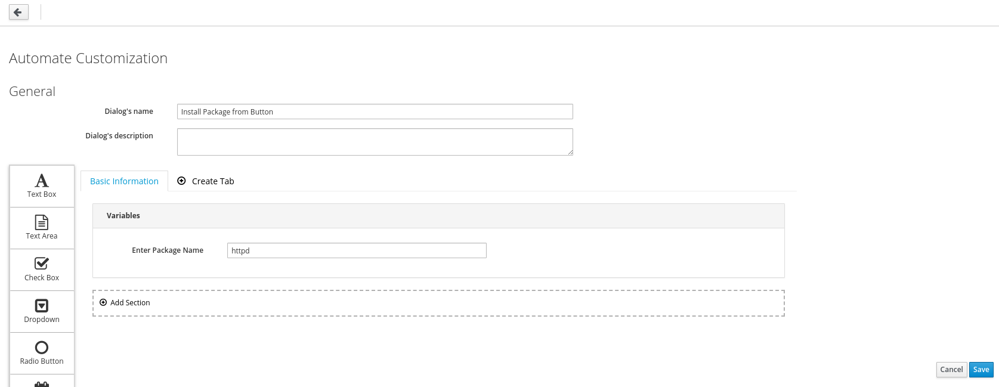

1. Click ***Save*** To save all changes we made in the Service Dialog

This concludes this part of the lab.

### Create improved Service Catalog Item

To be able to use the new Service Dialog with our button, we first have to create an additional Service Catalog Item, which points to the Service Dialog.

1. Navigate to ***Services*** -> ***Catalogs***

    

1. Navigate to ***Catalog Items*** in the accordion on the left

    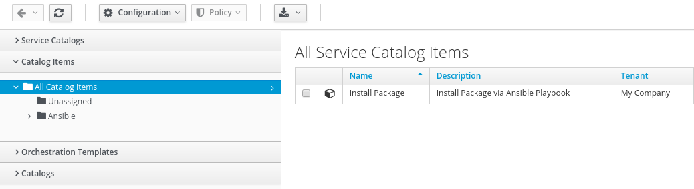

1. Click on ***Configuration*** -> ***Add a New Catalog Item***

    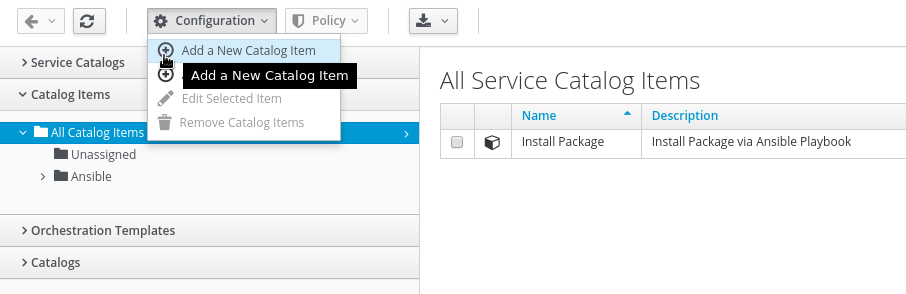

1. Select ***Ansible Playbook*** as Catalog Item Type

    

1. Use the following parameters when defining the Service Catalog Item:

    ***Name:*** Install Package from Button

    ***Description:*** Install Package via Ansible Playbook

    ***Display in Catalog:*** Yes

    ***Catalog:*** Ansible

    ***Repository:*** Github

    ***Playbook:*** playbooks/InstallPackage.yml

    ***Machine Credentials:*** Virtual Machine credentials

    ***Variables & Default Values***: add one new entry with:

    ***Variable:*** package_name

    ***Default Value:*** httpd

    :heavy_check_mark: ***NOTE*** Click the little plus ("+") icon to save the row.

    ***Dialog:*** Use Exiting

    Use "Install Package from Button" as the name of the Dialog, which is the one we created in the step before.

    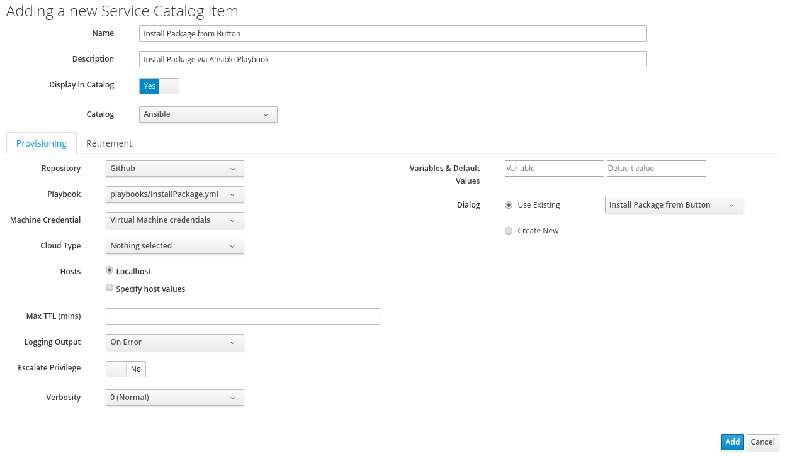

1. Click ***Add*** to save all changes

### Update the Button definition

As the last step, we have to change the definition of our button, to point to the just created Service Catalog Item.

1. Navigate to ***Automation*** -> ***Automate*** -> ***Customization***

    

1. Click on ***Buttons*** in the accordion on the left

    

1. Click on the "Install Package" Button you created in the previous lab

    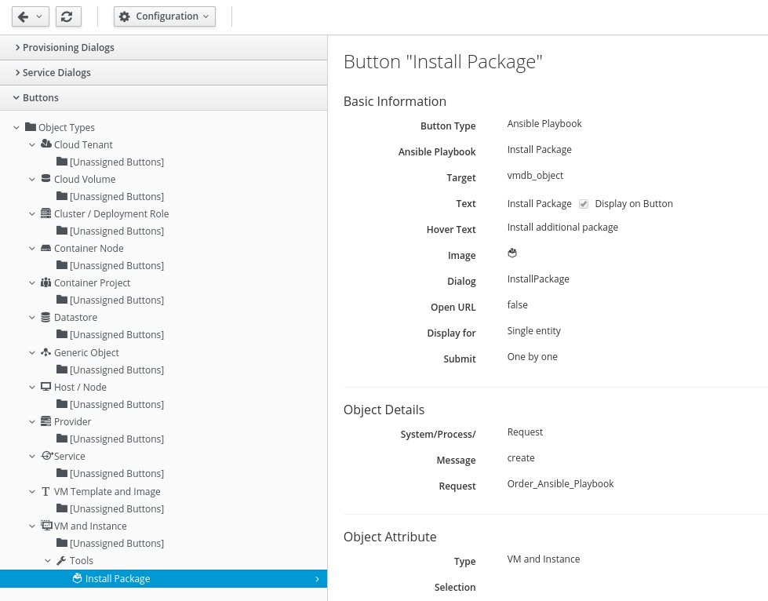

1. Click on ***Configuration*** -> ***Edit this Button***

1. Change the Playbook Catalog item to the new one you just created "Install Package from Button"

    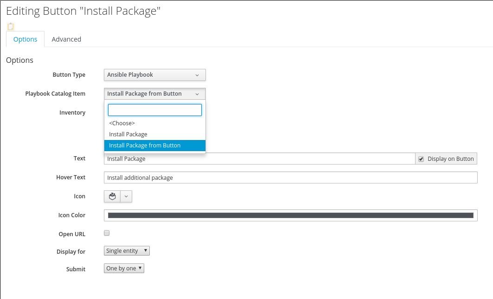

1. Click ***Save*** to store all changes

### Test the improved Button

1. Navigate to ***Compute*** -> ***Infrastructure*** -> ***Virtual Machines***

    

1. Click on the "cfme001" tile if not already selected

    

1. On the details page of "cfme001" click on ***Tools*** -> ***Install Package***

    

1. Click on ***Tools*** -> ***Install Package***

    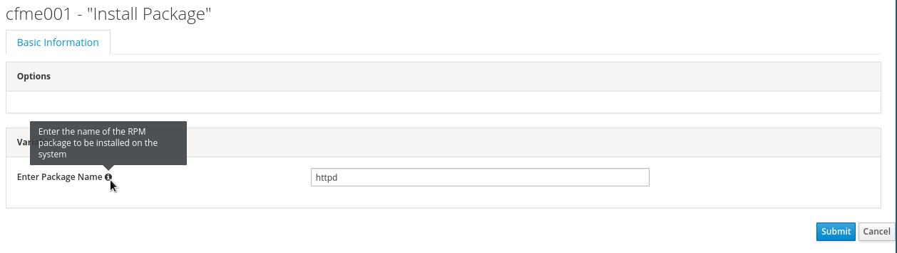

    You should see the simplified version of the Dialog. The Package Name has a better description, there is a tool tip if you hover the mouse over the little "i" icon and the redundant fields for "Machine Credentials" and "Hosts" are gone.

1. Click ***Submit*** to execute the Button action

1. Navigate to ***Services*** -> ***My Services***

    

1. As a result of your action, a new "My Services" object was created. If you don't see it yet, wait a minute and click on the reload button.

1. Click on the "Install Playbook" item to see the details

    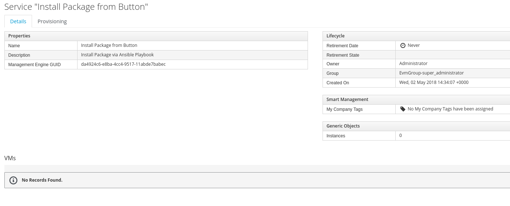

1. Click on the ***Provisioning*** tab to see output from your Ansible Playbook

    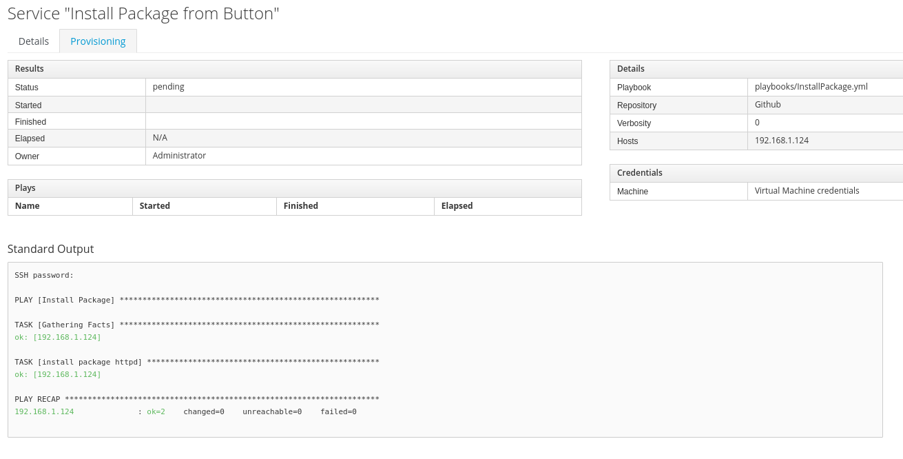

This concludes this part of the Ansible lab.

:+1: ***OPTIONAL*** Feel free to repeat this part of the lab with a different package name. You could use "screen" as an example instead of httpd - or some other package you want to install.

## Run an Ansible Playbook during VM provisioning

With the integration of Ansible into CloudForms, we want to make it easier for customers and partners to modify out of the box behavior and make it easy to integrate with third party solutions.

In this part of the lab, we want to run an Ansible Playbook during VM provisioning to show how to modify the State Machine and how we can use Ansible Playbooks.

### Create a new Automate Domain

Since the Automate Domains shipped with CloudForms are read only, we have to create our own Domain first.

1. Navigate to ***Automation*** -> ***Automate***

    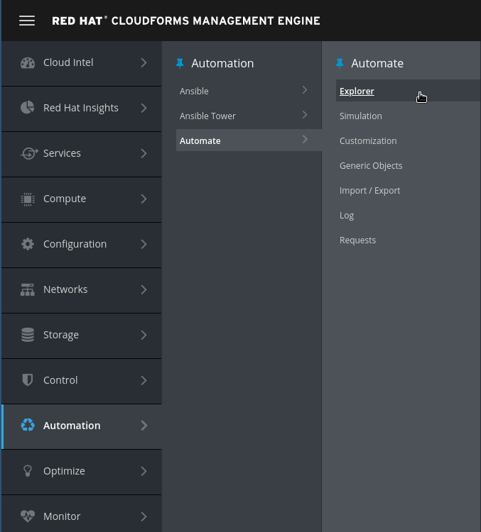

1. Click on ***Configuration*** -> ***Add a new Domain***

    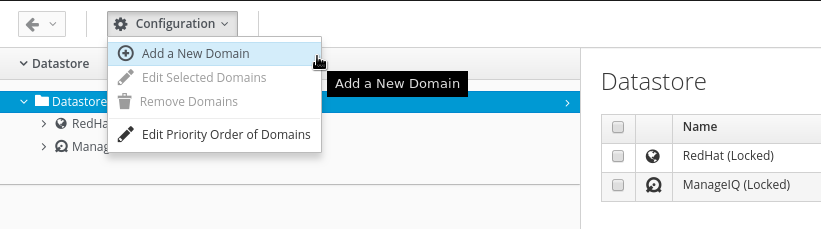

1. Enter the following details:

    ***Name:*** Lab

    ***Description:*** Lab Domain

    ***Enabled:*** Check

    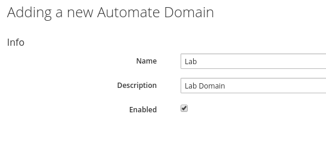

1. Click ***Add***

### Copy VM Provisioning State Machine

To be able to make changes to the State Machine, we have to copy it to our writeable Domain first.

1. Navigate to the VM Provisioning State Machine:

    ***ManageIQ*** -> ***Infrastructure*** -> ***VM*** -> ***Provisioning*** -> ***StateMachines*** -> ***VMProvision_VM*** -> ***Provision VM from Template (template)***

    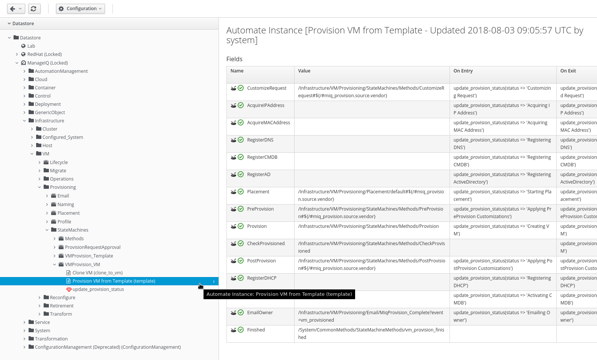

1. Click on ***Configuration*** -> ***Copy this Instance***

    

    :warning: ***WARNING*** Make sure you highlight the "Provision VM from Template (template)" instance when initiating the copy!

1. Accept the defaults when confirming the copy

    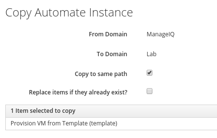

1. Click ***Copy*** to confirm

1. After the copy was completed, you should see a confirmation page

    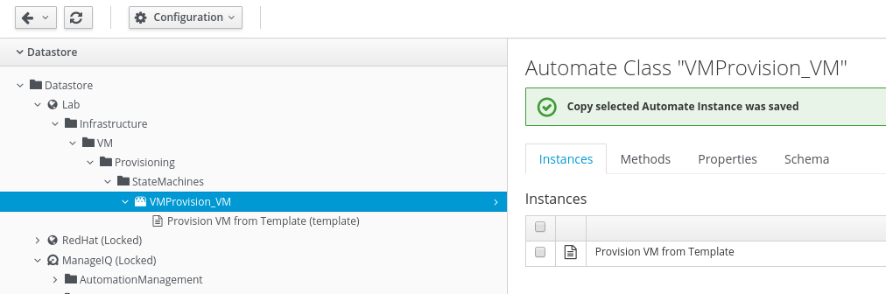

### Copy CheckProvisioned Method

The out of the box code of CloudForms will assume a VM was properly created, when it was successfully copied. Since we want to run an Ansible Playbook inside the deployed Virtual Machine, we have to add an additional check. The State Machine should only continue if the VM has an IP address assigned.

1. We also need a copy of the CheckProvisioned method, to do that, navigate to     ***ManageIQ*** -> ***Infrastructure*** -> ***VM*** -> ***Provisioning*** -> ***StateMachines*** -> ***Methods*** -> ***CheckProvisioned (check_provisioned)***

    

1. Click on ***Configuration*** -> ***Copy this Method***

    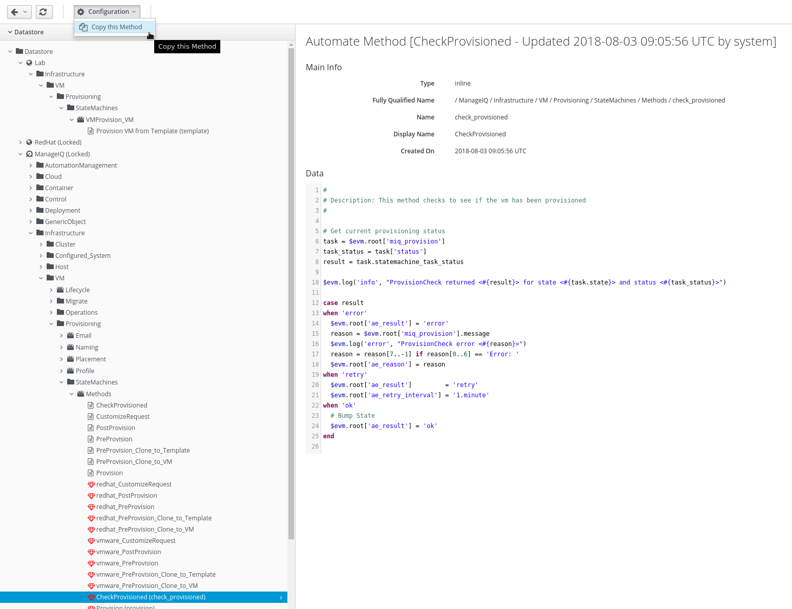

1. Keep the settings unmodified and click on ***Copy***

    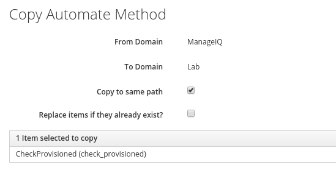

1. After the copy was created, you should see a confirmation message

    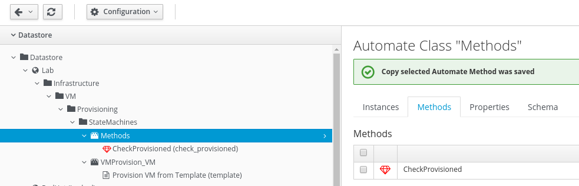

1. Click on ***Configuration*** -> ***Edit this Method***

    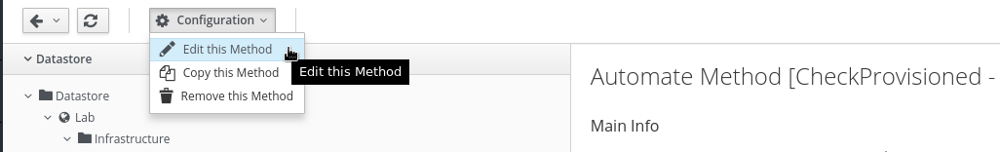

1. Add the end of the code, add the following snippet:

        vm = task.vm
        $evm.log("info","Current IP Addresses: #{vm.ipaddresses}") unless vm.nil?
        $evm.log("info", "VM is still nil") if vm.nil?

        if not vm.nil?
        if task.destination.ipaddresses.empty?
            $evm.root['ae_result']         = 'retry'
            $evm.root['ae_retry_interval'] = '1.minute'
        end
        end

    This code will go into an additional retry, if the Virtual Machine does not have an IP address (yet).

1. The method should look like this now.

    

1. Click on ***Validate*** to perform a basic syntax check and ***Save*** if no errors were found.

### Create the Ansible Playbook Method

Starting with CloudForms 4.6 we can create Methods of type "Playbook" which, instead of running Ruby code, execute an Ansible Playbook.

1. Since we're already in the correct folder, let's create a new Method to run an Ansible Playbook now. Click on ***Configuration*** -> ***Add a new Method***

    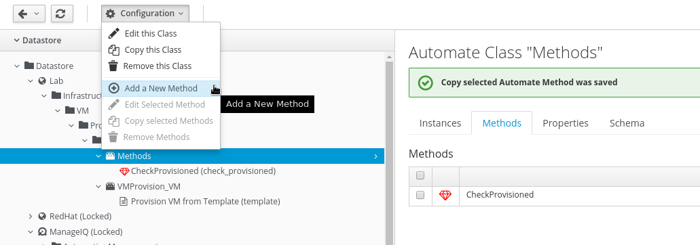

1. Switch the Method Type to "Playbook"

    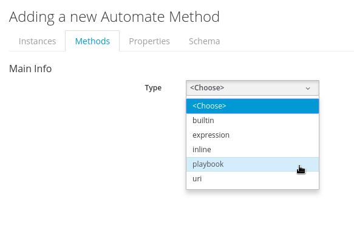

1. Use the following details to fill out the form.

    ***Name:*** install_package

    ***Display Name:*** Intall Package

    ***Repository:*** Github

    ***Playbook:*** playbooks/InstallPackage.yml

    ***Machine Credentials:*** VIrtual Machine Credentials

    ***Hosts:*** Specify host values and enter the following string into the text field:

        ${/#miq_provision.destination.ipaddresses.first}

    :warning: ***WARNING*** Pay attention to the special characters or the Playbook will not be executed on the correct Virtual Machine! The expression will configure CloudForms to use the first IP addresses of the provisioned Virtual Machine as the limit parameter when executing the Playbook.

    ***Max TTL (mins):*** 30

1. Enter the following ***Input Parameters***:

    ***Input Name:*** package_name

    ***Default Value:*** httpd

    :warning: ***WARNING*** Don't forget to click on the blue plus (+) icon to save the Input Parameter

1. Click ***Add*** to create the Ansible Playbook Method

    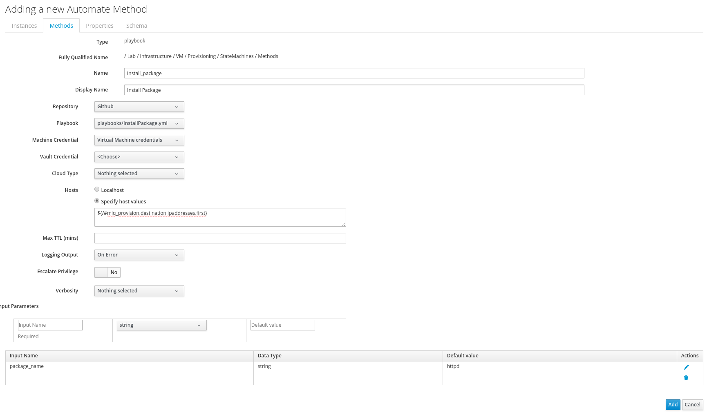

1. To be able to call the Method from a StateMachine, we need an associated Instance. Click on the ***Instances*** tab and ***Configuration*** -> ***Add a new Instance***

    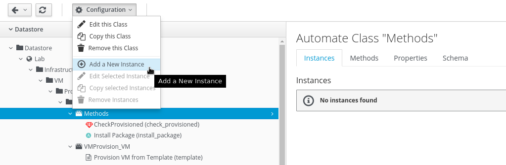

1. Enter the following details into the Dialog:

    ***Name:*** install_package

    ***Display Name:*** Install Package

    In the table search the row "execute" and put "install_package" into the "value" field

    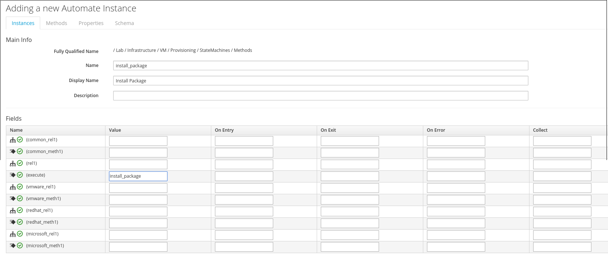

1. Click ***Add*** to save the Instance

### Modify the Schema

To run the Ansible Playbook during Virtual Machine Provisioning, we have to add an additional state to the State Machine.

1. Switch to the ***Schema*** tab of the page

    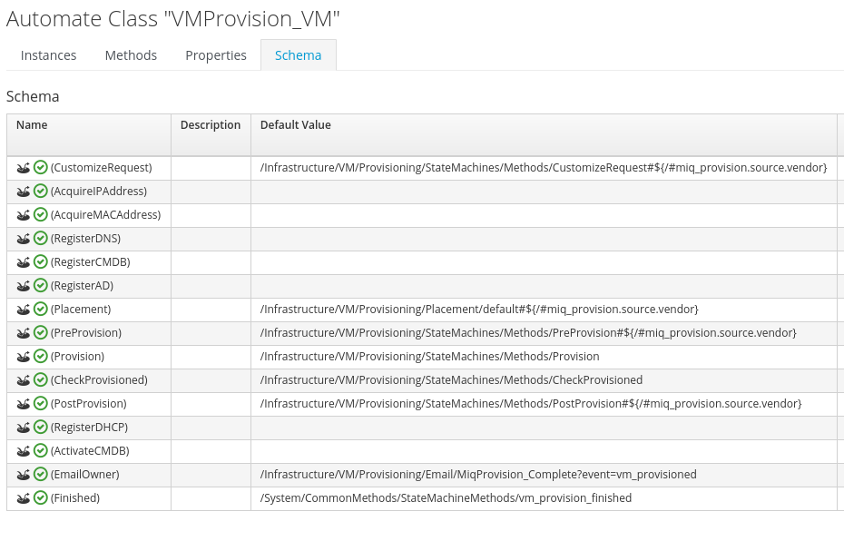

1. Click on ***Configuration*** -> ***Edit selected Schema***

    

1. Add a new row with the following details:

    ***Name:*** InstallPackage

    ***Type:*** State

    ***Data Type:*** Method

    ***Default Value:*** /Infrastructure/VM/Provisioning/StateMachines/Methods/install_package

1. Click the little check mark symbol at the beginning of the row to apply the change

1. Click ***Save*** to save the new Schema

1. After the change was applied, the updated Schema should look like this:

    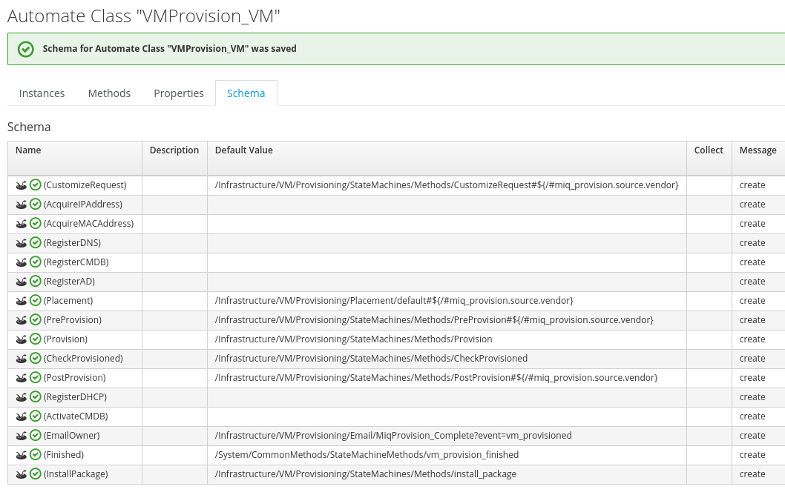

    :heavy_check_mark: ***NOTE*** There is a new line "InstallPackage" at the bottom of the table

    :warning: ***WARNING*** Do not try to continue with the next step, if you do not see the new "InstallPackage" line.

### Change Schema Sequence

To execute this new state after the Virtual Machine was created, we have to change the sequence.

1. Click on ***Configuration*** -> ***Edit Sequence***

    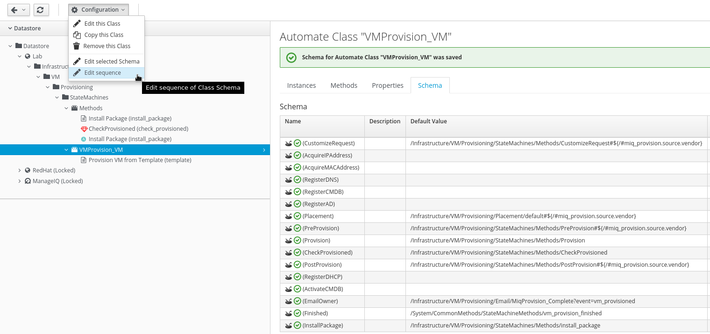

1, Use the arrow buttons to move the line "InstallPackage" between "CheckProvisioned" and "PostProvision"

    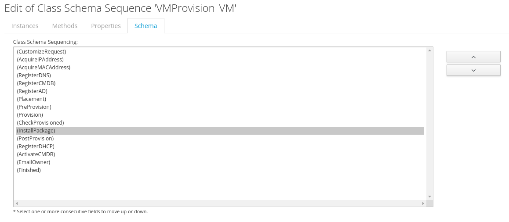

1. Click ***Save*** to apply the Schema sequence change

### Test the updated Virtual Machine Provisioning State Machine

We want to verify the applied changed by deploying a Virtual Machine and check if httpd was actually installed properly.

1. Navigate to ***Compute*** -> ***Infrastructure*** -> ***Virtual Machines***

    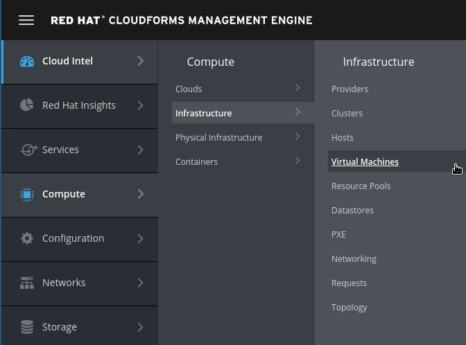

1. Click on ***Lifecycle*** -> ***Provision VMs***

    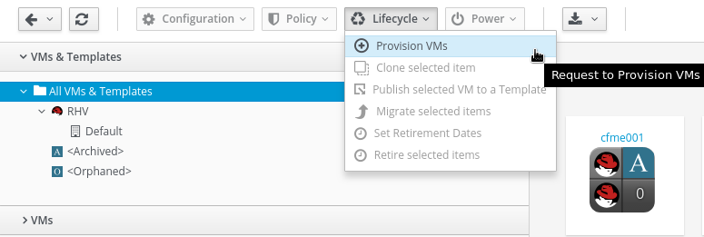

1. Select the "RHEL7" template

    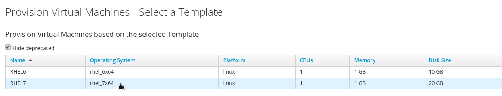

1. On the ***Requests*** tab the email address is the only required field. Enter your email address and optionally enter some data into the other fields as well

    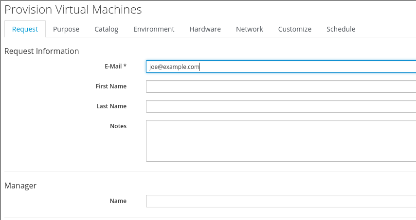

1. Switch to the ***Catalog*** tab and specify a VM name

    :warning: ***WARNING** Make sure to not use an existing name or provisioning will fail. You can use "changeme" and CloudForms will automatically assign a name to the Virtual Machine.

    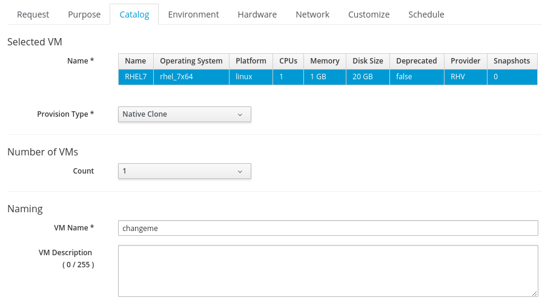

1. Switch to the ***Environment*** tab and check the following fields:

    ***Choose Automatically:*** not selected

    ***Datacenter:*** Default

    ***Cluser:*** Default

    ***Host:*** rhv1

    ***Datastore:*** data

    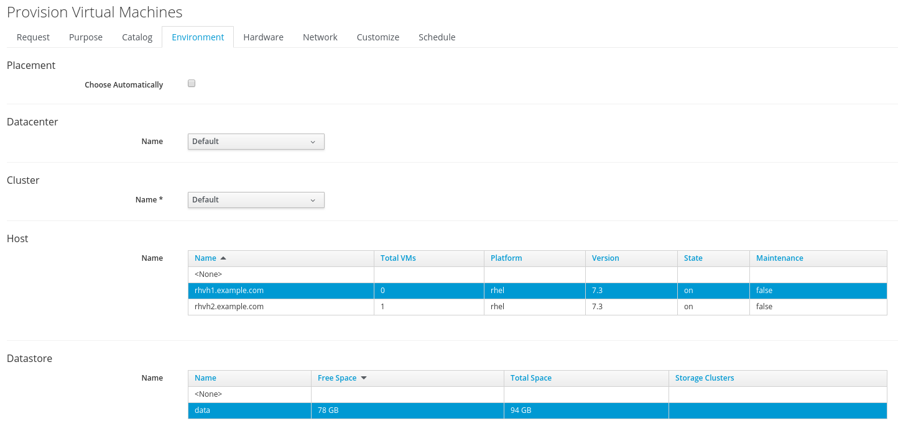

1. Click ***Submit*** to place your request

1. You will be redirected to the Requests page. You can use the ***Refresh*** button on the top of the page, since it does not automatically reload, to watch your request progressing.

1. TODO: instructions on how to verify

## Advanced labs

If you were able to complete all the steps and still have some time left, here are a couple of things you can do to get more familiar with CloudForms.

### Use the Self Service user Interface

The user interface we used so far is often referenced as the "Operations UI" or the "Classic UI". A new, more modern, Self Service user Interface is also available and receives improvements with every release.

The Self Service user Interface can be accessed by appending the string "self_service" to the Appliance URL.

    https://cf46-<GUID>.labs.rhepds.com/self_service

You can login with the same credentials as before.

### Build a button to execute remote commands

You have learned how to create a Service Dialog, Ansible Playbook Service Catalog Item and how to use them from a Button to extend the out of the box features provided by CloudForms. We can use this knowledge to implement a button to allow users to execute remote commands on a Virtual Machine.

This is a very popular use case because it provides a number of advantages:

- administrators can allow VM owners to run specific commands themselves, so they don't have to open a service request with IT
- administrators can also use CloudForms' powerful Role Based Access Control to make buttons only available to specific user groups
- administrators can grant end users to run commands as a privileged user (e.g. root), without handing out credentials or setting up ACL's on all managed systems
- users can run specific tasks by themselves and don't have to open an internal ticket or wait for someone with the necessary privileges to do it for them

Since this is an advanced lab, there are no detailed step by step instructions. Instead here are couple of pointers to get you on track:

#### The use case

We want end users to able to run certain remote commands by themselves. First we try this with a text box where users can enter their command - but as an additional improvement you should try to replace the text box with a drop down list, where users can only select from a list of pre approved commands.

#### Service Dialog

Based on your work with "Install Package" Service Dialog, you should know what is needed to create a new Service Dialog for this use case. 

Start with a simple copy of your working example. Add a text box to ask the user for the command. It is important that you set the name for the text element correctly. 

:warning: ***WARNING*** Make sure the text box name is called "param_command" - because "command" is the name of the extra variable in the Ansible Playbook. If you chose a different name, the Playbook will use the default command, which is "echo hello world".

#### Service Catalog Item

To be able to call an Ansible Playbook from a button, you need to create a Service Catalog Item first. This should be very easy for you, since you've done this before in this lab. Just make sure you run the correct playbook and use the Service Dialog you created in the previous step.

The name of the Ansible Playbook is "operatorcommand.yaml"

#### Button

Create a new Button and add it to the existing Button Group "Tools" - or create a new one. Use the Service Catalog Item created in the previous step when you define the button.

#### Improve it further

The advanced settings of a Button allow you to use Role Based Access Control. Check the "Role Access" option at the bottom of the settings page.

Another cool feature is the "Enablement". Since we are using Ansible Playbooks, the Virtual Machine has to be powered on, or the Playbook will fail. With the "Enablement" you can disable your button, if the VM is off and show a pop up notification explaining the situation to the user.

You can use the expression builder to check if the field "VM and Instance: Power State" has the value "on". Use the "Disabled Button Text" to show a hint to the user, for example:

    The VM has to be powered on to execute this action

And if you're still having more time, you can use the "Visibility" to show the Button only for Linux VMs, and not for Windows.

#### Need Help?

Don't hesitate to ask any of the lab organizers for help, if you're stuck!

## Even more?

If you're already done and still have some time left, here are some ideas for advanced labs:

- try to retire the "create user" service catalog item and see if the user is indeed deleted
- upload icons to make the Service Catalog more appealing
